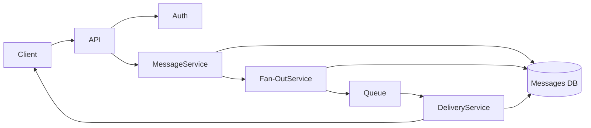
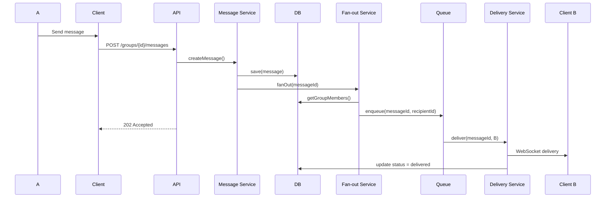

## 🔹 Variant 4 — Group Chat
**Focus:** scaling delivery logic

**Additional requirements:**
- Messages sent to multiple recipients
- Separate delivery status per recipient

**Key questions:**
- Fan-out strategy
- Performance implications
---

## Part 1 - Component Diagram:


---
## Part 2 — Sequence Diagram:


---
## Part 3 — State Diagram(Message):

```mermaid
Created
→ Stored
→ FanOutTriggered
→ DeliveryInProgress
→ FullyDelivered
→ FullyRead
```
---
## Part 4 — ADR

```markdown
# ADR-001: Fan-out on Write for Group Chat

## Status
Accepted

## Context
Group messages must be delivered to multiple recipients.
Each recipient requires independent delivery tracking.
Users may be online or offline.

## Decision
Use asynchronous Fan-out on Write.
After saving a message, the system retrieves group members
and enqueues one delivery task per recipient.

## Alternatives

### Fan-out on Read
Rejected — does not support real-time delivery well.

### Direct WebSocket broadcast
Rejected — does not support offline users or retries.

## Consequences

+ Independent delivery tracking
+ Reliable asynchronous delivery
+ Scales with worker count

- More delivery tasks for large groups
- Requires queue monitoring
```

---


