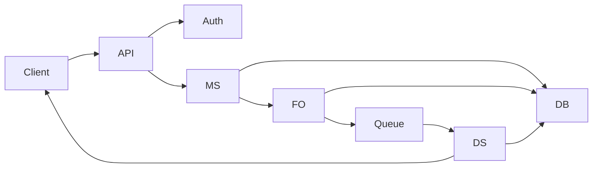

## 🔹 Variant 4 — Group Chat
**Focus:** scaling delivery logic

**Additional requirements:**
- Messages sent to multiple recipients
- Separate delivery status per recipient

**Key questions:**
- Fan-out strategy
- Performance implications
---

## Component Diagram:

---

